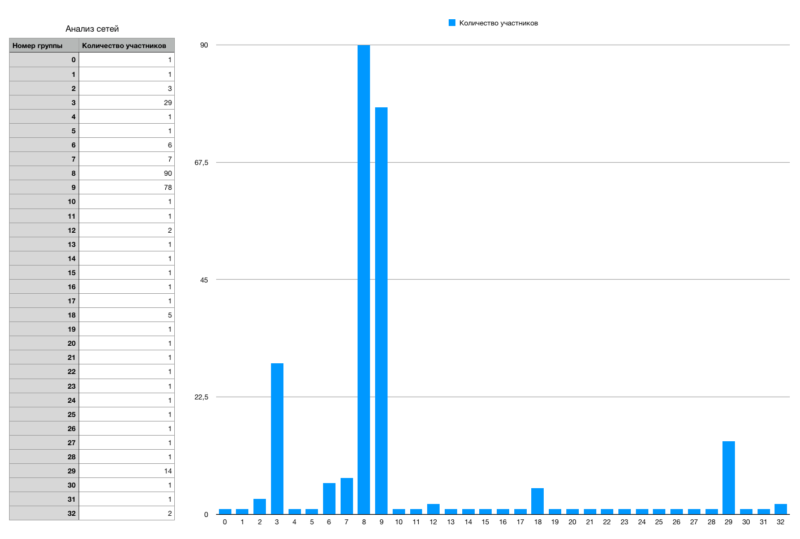

# Сетевой анализ

## Датасет - друзья ВКонтакте

**Самые многочисленные группы:** 8, 9, 3 и 29.

- Группы 8 **90 человек** - друзья из моей прошлой школы и района, в котором я проживаю, хотя также в эту группу попали некоторые люди, просто имеющие в качестве общих друзей моих одноклассников, что можно считать ошибкой при разделении на сообщества.

- Группа 9 **78 человек** - друзья и знакомые из лицея. Так же, как и в предыдущем случае, сюда попали некоторые люди, которые знакомы с лицеистами, но ими не являющиеся.

- Группа 3 **29 человек** - друзья и знакомые из лагеря. Ещё здесь оказались люди, каким-либо образом связанные с той организацией, которая проводила этот лагерь.

- Группа 29 **14 человек** - и тут ещё один лагерь. Не содержит ошибок, хотя эта группа не так многочисленна, как предыдущие.

В остальных выделенных сообществах содержится от 1 до 7 человек. Всего сформировалось 32 группы.